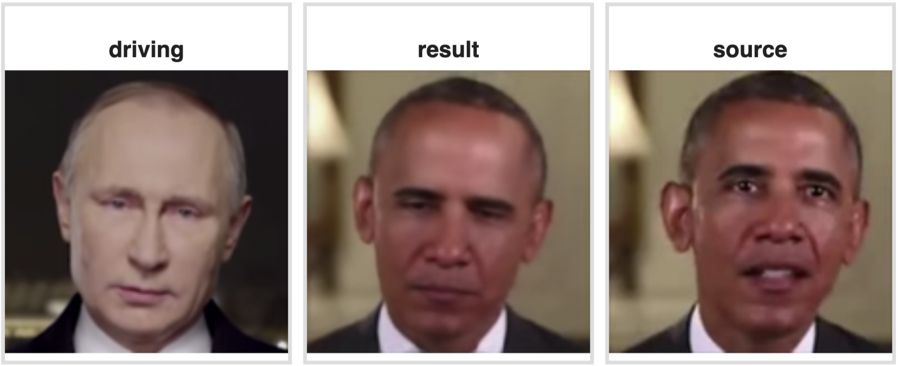
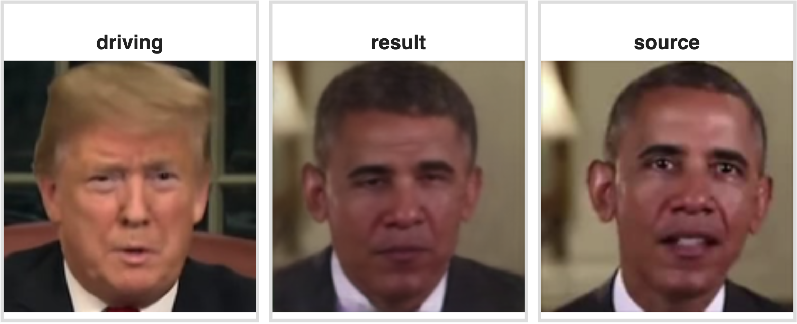
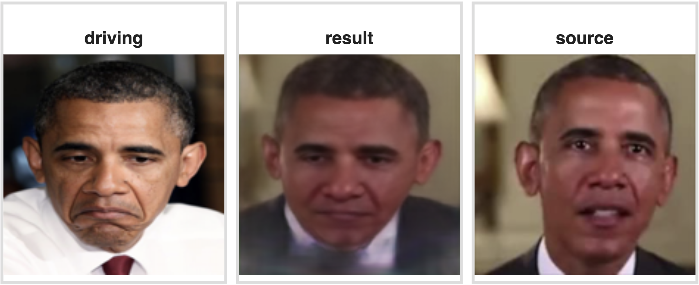
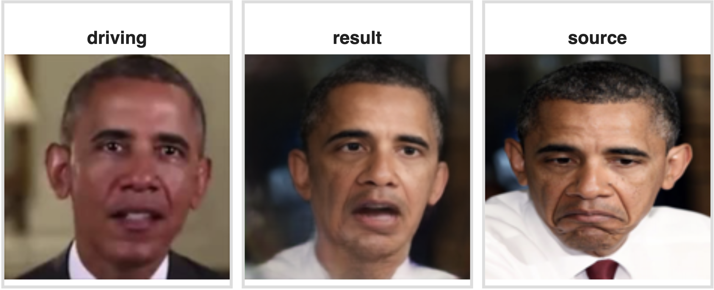
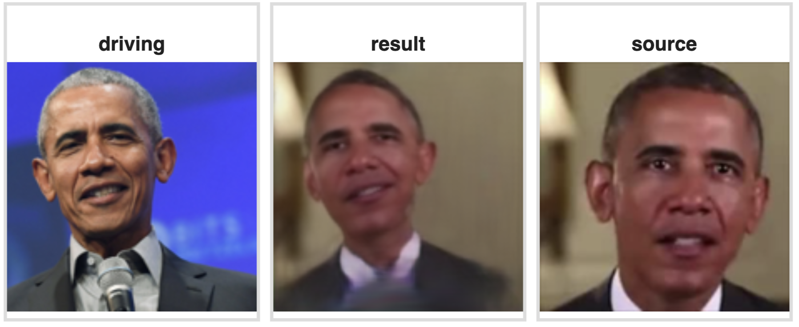

# First Order Motion Model for Facial Expression Transfer  

The First Order Motion Model was altered to function with a single source image and a single drive image, transferring facial emotions from one face to another.

### Datasets

1. **Fashion**. 
Can be used to transfer body pose.

1. **Taichi**. 
Can be used to transfer body pose.
 
1. **VoxCeleb**. 
Can be used to transfer facial expresions.

### To train the models check 
https://github.com/AliaksandrSiarohin/first-order-model

### Colab Demo 
There is a  prepared a gui-demo using google-colab see: ```demo.ipynb```. 

### Examples
 
 
 
 
 

### Use cases
1. Fix your 'bad' selfies 
